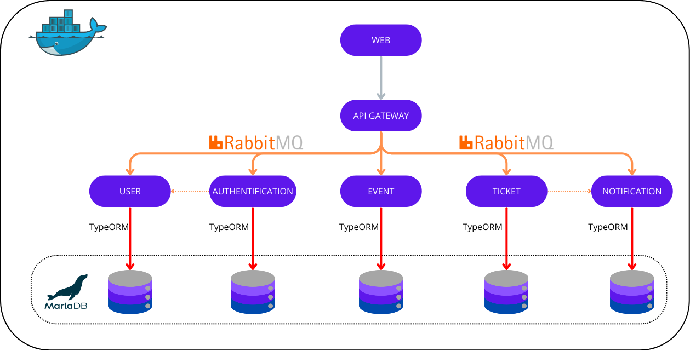

# Documentation du Projet


## Table des Matières

- [Description du Projet](#description-du-projet)
- [Installation et Prérequis](#installation-et-prérequis)
  - [Back-end / Front-end](#back-end-/-front-end)
  - [ImagBB](#imagebb)
- [Structure du Projet](#structure-du-projet)
  - [Architecture](#architecture)
  - [Outils](#outils)
  - [Back-end](#structure-du-back-end)
  - [Front-end](#structure-du-front-end)
- [Fonctionnalités](#fonctionnalités)
  - [Gestion des Utilisateurs](#gestion-des-utilisateurs)
  - [Authentification](#authentification)
  - [Gestion des Events](#gestion-des-events)
  - [Gestion des Réservations](#gestion-des-réservations)
- [Autors](#autors)
- [Github Repository](#repositories)

## Description du Projet

Cette application permet la gestion des tickets pour des événements. Elle repose sur une architecture microservices et inclut des fonctionnalités de gestion des utilisateurs, des événements, des tickets et des paiements.

### Endpoints de l'API

L'API RESTful du projet est documentée avec Swagger. Vous pouvez accéder à la documentation interactive de l'API via Swagger localhost:4000/api/docs.

---

## Installation et Prérequis
  > Docker et Docker Compose doivent être installés sur votre machine.

### Back-end / Front-end
1 - Cloner le projet
```bash 
git clone <repository-url>
cd <nom-du-projet>
```
2 - Lancer les services avec Docker Compose
```bash 
docker-compose up -d
```
3 - Vérifier les logs des services
```bash 
docker-compose logs -f
```
Pour arrêter les services
```bash 
docker-compose down
```
### ImageBB  

  > ImgBB est un service d'hébergement d'images en ligne qui permet de télécharger, stocker et partager facilement des images. Dans ce projet, ImgBB est utilisé pour gérer les images téléchargées par les utilisateurs. L'intégration avec l'API permet de télécharger des fichiers directement et de récupérer un lien direct vers l'image hébergée, ce qui facilite leur utilisation dans l'application (par exemple, pour afficher des images d'hôtels ou de profils d'utilisateur)
---

## Structure du Projet

### Architecture


### Outils
<div align="center">
  
  
  
  
  
  
  
  
  
  
  
  
  
</div>

### Back-end

Le back-end est une API RESTful construite avec NestJS, utilisant JWT pour l'authentification et MariaDB pour le stockage des données. Il repose sur une architecture microservices où chaque service est indépendant et communique via RabbitMQ.

La structure du projet NestJS suit un modèle modulaire qui permet de gérer les différentes fonctionnalités de manière propre et organisée. Voici une explication détaillée de l'architecture du projet

- `api_gateway` : Point d'entrée principal de l'application, il redirige les requêtes vers les différents microservices.
- `authentification_service` : Gestion de l'authentification des utilisateurs avec JWT.
- `user_service` : Gestion des profils utilisateurs (CRUD, mise à jour, suppression).
- `event_service` : Gestion des événements (création, modification, suppression).
- `ticket_service` : Gestion des tickets pour les événements.
- `notification_service` : Gestion des notifications envoyées aux utilisateurs après des actions comme un achat de billet, en utilisant RabbitMQ.
 
### Front-end
Le front-end de l'application est développé avec React, en utilisant TypeScript pour assurer une meilleure maintenabilité et robustesse du code. L'interface utilisateur est construite avec MUI (Material-UI), qui offre des composants réactifs et personnalisables.


## Fonctionnalités

### Gestion des Utilisateurs

- **Créer un utilisateur** : Permet de créer un nouvel utilisateur sans être connecté.
- **Lire un utilisateur** : Un utilisateur peut lire ses propres informations. Les administrateurs peuvent lire les informations de tous les utilisateurs.
- **Mettre à jour un utilisateur** : Un utilisateur peut mettre à jour ses informations. Les administrateurs peuvent modifier les informations de tout utilisateur.
- **Supprimer un utilisateur** : Les administrateurs peuvent supprimer tous les comptes.

#### User Routes
| Method  | Endpoint                   | Description           |
|---------|----------------------------|-----------------------|
| POST    | `/users`                     | Create a new user    |
| GET     | `/users`                     | Get all users        |
| GET     | `/users/{id}`                | Get user by ID       |
| PATCH   | `/users/{id}`                | Update user          |
| DELETE  | `/users/{id}`                | Delete user          |
---

### Authentification

L'authentification est gérée via **JWT** (JSON Web Token). Un utilisateur doit se connecter pour obtenir un jeton JWT qui doit être inclus dans l'en-tête des requêtes API pour accéder aux fonctionnalités sécurisées.

#### Auth Routes
| Method | Endpoint        | Description         |
|--------|---------------|---------------------|
| POST   | `/auth/login`  | User login         |
| POST   | `/auth/register` | User registration |
---

### Gestion des Events

- **Lister les Events** : Tous les utilisateurs peuvent voir la liste des events.
- **Créer un Events** : Seuls les administrateurs et les eventcreators peuvent créer des events.
- **Mettre à jour un Events** : Seuls les administrateurs et les eventcreators peuvent mettre à jour un events.
- **Supprimer un Events** : Seuls les administrateurs et les eventcreators peuvent supprimer un event.

#### Hotel Routes
| Method  | Endpoint                    | Description           |
|---------|-----------------------------|-----------------------|
| POST    | `/events`                     | Create a new event   |
| GET     | `/events`                     | Get all events       |
| GET     | `/events/{id}`                | Get event by ID      |
| PATCH   | `/events/{id}`                | Update event        |
| GET     | `/events/me`                  | Get all event by eventcreator      |
| DELETE  | `/events/{id}`                | Delete event         |
---

### Gestion des Réservations

- **Créer une réservation** : Un utilisateur connecté peut réserver une place.
- **Lire une réservation** : Un utilisateur peut voir ses propres réservations. Un administrateur peut consulter toutes les réservations.
- **Mettre à jour une réservation** : Un administrateur peut modifier toutes les réservations.
- **Supprimer une réservation** : Un administrateur peut supprimer toutes les réservations.

#### Booking Routes
| Method  | Endpoint               | Description            |
|---------|------------------------|------------------------|
| POST    | `/tickets`             | Create a new ticket |
| GET     | `/tickets`             | Get all tickets      |
| GET     | `/tickets/{id}`        | Get tickets by ID     |
| PATCH   | `/tickets/{id}`        | Update ticket       |
| DELETE  | `/tickets/{id}`        | Delete ticket       |
| GET     | `/tickets/user/{id}`   | Get user ticket     |
| GET     | `/tickets/event/{id}`   | Get all tickets for an event     |
| POST    | `/tickets/payment`   | Process to a ticket payment    |

---

## Authors

- [@Yoann-Michon](https://github.com/Yoann-Michon)
- [@AlberolaConstant](https://github.com/AlberolaConstant)

## Repositories
- Backend 
>https://github.com/Yoann-Michon/Test_Unit_Fonc_E2E
- front 
>https://github.com/Yoann-Michon/Test_Unit_Fonc_E2E_Front
